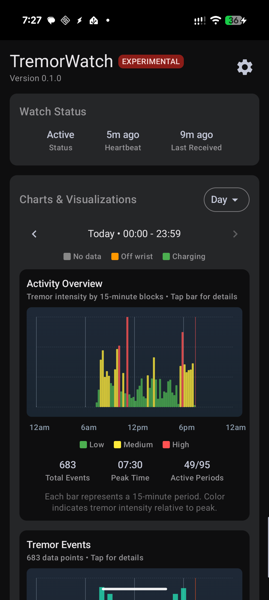
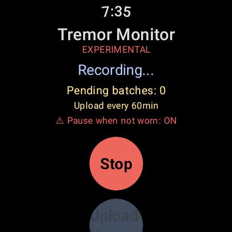

# TremorWatch

A Wear OS and Android application for experimental tremor monitoring and analysis.

**⚠️ EXPERIMENTAL SOFTWARE - USE AT YOUR OWN RISK - NOT A MEDICAL DEVICE**

---

## Quick Overview

**What it does:**
- Continuously monitors accelerometer data on your Wear OS watch
- Detects tremor patterns using FFT (Fast Fourier Transform) analysis
- Sends data to your phone for visualization and optional InfluxDB upload
- Provides customizable tremor detection algorithms

**What you need:**
- Wear OS watch (API 30+) 
- Android phone (API 26+)
- Patience - this is highly experimental alpha software

**Key Features:**
- ✅ Real-time tremor detection on watch
- ✅ Interactive charts on phone (severity, events, activity)
- ✅ **Algorithm customization UI** (frequency bands, thresholds, sensitivity)
- ✅ Local data storage (configurable retention)
- ✅ Optional InfluxDB integration
- ✅ CSV export
- ✅ Pull-to-refresh on main screen

### Screenshots

| Phone App | Watch App |
|-----------|-----------|
|  |  |

---

## Installation

### Quick Install (Recommended)

**Download Pre-built APKs** from the [Releases page](../../releases):
- `TremorWatch-Phone-v0.1.0-alpha.apk` - Install on your Android phone
- `TremorWatch-Watch-v0.1.0-alpha.apk` - Install on your Wear OS watch

**Installation Steps:**

1. **Install ADB** (Android Debug Bridge):
   - Download from [Android developer site](https://developer.android.com/tools/releases/platform-tools)
   - Extract and add to PATH, or run from the extracted folder
   
   > **Note:** These are basic instructions. For device-specific setup, search "ADB setup [your device model]" for detailed guides.

2. **Enable Developer Mode** on both devices:
   - Settings → About → Tap "Build number" 7 times
   - Settings → Developer Options → Enable "ADB debugging"
   - Watch: Enable "Debug over Wi-Fi" and note the IP address and port
   
   > **Note:** ADB setup varies by device. If you encounter issues, search for "ADB setup [your device model]" for device-specific instructions.

3. **Connect via ADB:**
   ```bash
   # Connect phone via USB (should auto-detect)
   adb devices
   
   # Connect watch via Wi-Fi (replace PORT with the port shown on watch)
   adb connect <WATCH_IP>:PORT
   ```

4. **Install APKs:**
   ```bash
   # Install on phone
   adb install TremorWatch-Phone-v0.1.0-alpha.apk
   
   # Install on watch (use -s to specify device if multiple connected)
   adb -s <WATCH_IP>:PORT install TremorWatch-Watch-v0.1.0-alpha.apk
   ```

5. **Configure Battery Optimization (CRITICAL):**
   
   **Phone:**
   - Open app → Follow prompts to disable battery optimization
   - OR: Settings → Apps → TremorWatch → Battery → "Don't optimize"
   
   **Watch (via ADB - REQUIRED):**
   ```bash
   adb -s <WATCH_IP>:PORT shell dumpsys deviceidle whitelist +com.opensource.tremorwatch
   ```
   
   **Samsung Galaxy Watch users:**
   - Also add to "Never sleeping apps" in Galaxy Wearable app

6. **Done!** Open the app on your watch to start monitoring.

---

## Using the App

### First Time Setup - Calibration (IMPORTANT)

**What is calibration?**
Calibration teaches the app what your "baseline" movement looks like when you're NOT having tremors. This helps it accurately detect when actual tremor activity occurs.

**When to calibrate:**
- **Critical:** Do this when you're at your STILLEST
- If you can't stay perfectly still, calibrate during your calmest period (e.g., after medication, when resting)
- The stiller you are during calibration, the more accurate the detection will be

**How to calibrate:**

1. **On your watch:**
   - Open TremorWatch
   - Tap the settings icon (gear)
   - Select "Calibrate Baseline"
   - Rest your arm/hand in your normal resting position
   - Stay as still as possible for 30 seconds
   - The watch will collect baseline data

2. **After calibration:**
   - The app will now monitor continuously
   - It compares current movement to your baseline
   - Tremor events are detected when movement exceeds baseline patterns

**Re-calibration:**
- Recalibrate if your tremor patterns change significantly
- Recalibrate if medication dosage changes
- Recalibrate if the app seems too sensitive or not sensitive enough

### Watch App Features

**Main Screen:**
- **Status**: Shows if monitoring is active
- **Current Severity**: Real-time tremor severity (0-100)
- **Tremor Type**: Resting, Postural, or Action tremor detected
- **Settings**: Access calibration and monitoring options

**Settings Options:**
- **Calibrate Baseline**: Set your baseline movement pattern
- **Pause When Not Worn**: Automatically stops monitoring when watch is removed (saves battery)
- **Store Locally**: Keep tremor data on the watch (syncs to phone when connected)

### Phone App Features

**Main Screen:**
- **Watch Status**: Connection status, last heartbeat, battery optimization status
- **Interactive Charts**:
  - **Tremor Activity**: 15-minute blocks showing tremor intensity
  - **Tremor Severity**: Continuous severity over time
  - **Tremor Events**: Individual tremor episodes detected
- **Pull to Refresh**: Swipe down to update all data

**Data Management:**
- **Time Range Selector**: View data from last 12 hours, 24 hours, 48 hours, or 7 days
- **Scroll Through History**: Swipe left/right on charts to see earlier data
- **CSV Export**: Export all data
- **Local Storage Settings**: Configure how long to keep data (default: 7 days)

**Algorithm Customization** (Advanced):
- Access via Settings → "Algorithm Customization"
- Adjust frequency ranges for different tremor types
- Fine-tune detection sensitivity
- Customize severity calculation
- **Note:** Default settings work for most users - only adjust if needed

**Optional InfluxDB Upload:**
- Configure remote database for long-term storage
- Set WiFi-only uploads to save cellular data
- Requires location permission (to detect home WiFi only)

---

## Permissions Explained

### Phone App Permissions

**Required Always:**
- ✅ **Battery Optimization Disable**: Keeps background service running for continuous data reception

**Required for InfluxDB Upload (Optional):**
- 📍 **Location (Fine)**: Android requires this to read WiFi SSID/BSSID for home network detection
- 📍 **Background Location**: Allows checking if you're home even when app is in background
- 📡 **WiFi State**: Reads current WiFi network information

**Why Location for WiFi?**
Android considers WiFi network info (SSID/BSSID) as location data because it can be used to determine physical location. The app uses this ONLY to:
1. Detect if you're connected to your home WiFi
2. Upload to InfluxDB only when on your home network (if "WiFi only" is enabled)

The app does NOT track your GPS location or send location data anywhere.

**Optional:**
- 🔔 **Notifications**: Shows upload status and data reception alerts

### Watch App Permissions

- ✅ **Body Sensors**: Reads accelerometer data for tremor detection
- ✅ **Battery Optimization Disable**: Prevents OS from killing the monitoring service

---

## Configuration

The phone app provides all configuration options:

- **Data Management**: View charts, export data, manage local storage
- **Algorithm Customization**: Tune tremor detection parameters
- **InfluxDB Upload**: Optional remote database integration
- **Settings**: Configure retention, WiFi-only uploads, etc.

---

## ⚠️ CRITICAL DISCLAIMERS

### Medical Disclaimer

**THIS IS NOT A MEDICAL DEVICE. THIS IS NOT MEDICAL SOFTWARE.**

- **NO MEDICAL USE**: Experimental research and educational purposes ONLY
- **NOT VALIDATED**: Not tested, validated, or approved by any medical/regulatory authority
- **NOT DIAGNOSTIC**: Cannot be used for diagnosis, treatment, or medical decisions
- **CONSULT PROFESSIONALS**: Always consult qualified healthcare professionals
- **NO LIABILITY**: Developers assume ZERO liability for any use
- **NO ACCURACY CLAIMS**: No claims made about accuracy, reliability, or correctness

### Software Disclaimer

- **EXPERIMENTAL**: Alpha software (v0.1.0) - expect bugs
- **UNTESTED**: No formal testing or validation
- **UNRELIABLE**: May produce incorrect, inconsistent, or meaningless results
- **BATTERY DRAIN**: Significant battery consumption (5-10%/hour on watch)
- **HIGHLY EXPERIMENTAL DETECTION**: Default algorithms are generic approximations
- **CUSTOMIZATION REQUIRED**: You MUST tune the detection algorithm for your specific case
- **NO SUPPORT**: Provided as-is, no warranty or guaranteed support

**The tremor detection algorithm is HIGHLY EXPERIMENTAL and may produce false positives, false negatives, or completely inaccurate results. It is NOT calibrated for any specific tremor type or individual.**

---

## Algorithm Customization

### ⚠️ Detection Algorithm is HIGHLY EXPERIMENTAL

The default tremor detection uses generic parameters that **WILL NOT** work well for everyone. Results may be meaningless without customization.

### Customization UI

The phone app includes a **Tremor Detection Settings** screen where you can customize:

**Frequency Bands:**
- Resting tremor range (Hz)
- Postural tremor range (Hz)  
- Action tremor range (Hz)

**Detection Thresholds:**
- Minimum tremor power
- Band ratio requirements
- Confidence thresholds

**Severity Calculation:**
- Severity scaling factors
- Minimum severity floor

**Temporal Smoothing:**
- Episode duration windows
- Gap tolerance

**To Access:**
1. Open phone app
2. Settings (top right)
3. "Algorithm Customization"
4. Adjust parameters
5. Changes sync automatically to watch

---

## Battery Impact

**⚠️ WARNING: This app WILL drain your battery.**

**Expected Drain:**
- **Watch**: 5-10% per hour (continuous accelerometer monitoring)
- **Phone**: 1-3% per hour (data reception, storage, uploads)

**Why So Much?**
- Continuous 20 Hz accelerometer sampling
- Real-time FFT calculations every second
- Background services always running
- Network/Bluetooth communication

**This is intentional** for continuous monitoring. Battery optimization MUST be disabled or the app will stop working.

---

## Building from Source

<details>
<summary>Click to expand build instructions</summary>

### Prerequisites

- Android Studio Hedgehog or newer
- JDK 17
- Android SDK with API 30+

### Build Steps

1. **Clone the repository:**
   ```bash
   git clone https://github.com/daveaus/TremorWatch.git
   cd TremorWatch
   ```

2. **Build APKs:**
   ```bash
   # Build both phone and watch apps
   ./gradlew app:assembleDebug phone:assembleDebug
   
   # Or build individually:
   ./gradlew phone:assembleDebug  # Phone app only
   ./gradlew app:assembleDebug    # Watch app only
   ```

3. **Install Phone App:**
   ```bash
   adb install phone/build/outputs/apk/debug/phone-debug.apk
   ```

4. **Install Watch App:**
   ```bash
   # Connect to watch first
   adb connect <WATCH_IP>:PORT
   
   # Install on watch
   adb -s <WATCH_IP>:PORT install app/build/outputs/apk/debug/app-debug.apk
   ```

5. **Configure Battery Optimization** (see Installation section above)

</details>

---

## License

GNU General Public License v3.0 - See LICENSE file for details.

This software is free to use and modify, but any derivative works must also be open source.
